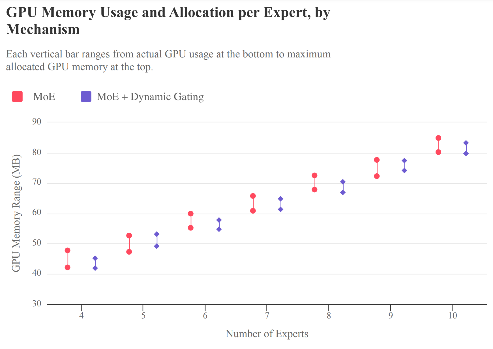

# Project for Big Data and ML System

## Author

- Sanho Lee (shl8607@nyu.edu)
- Euijae Kim (ek3955@nyu.edu)

## Installation

> GPU is required

```
pip install -r requirements.txt
```

## Run

In our investigation, we analyze two distinct models: the Mixture of Experts (MoE) and MoE with Dynamic Gating. Utilizing the following commands, we can ascertain the GPU memory consumption per expert for each model. By executing these commands, we gain insights into the resource utilization patterns and memory requirements of both MoE and MoE with Dynamic Gating models, facilitating a comparative analysis of their performance and efficiency. This examination aids in identifying potential areas for optimization and improvement within each model variant.

### Mixture of Experts (MoE)

```
python ./src/example_moe_cifar10.py
```

### MoE + Dynamic Gating

```
python ./src/example_moe_dynamic_gating_cifar10.py
```

## Results



## Code Credit and Modification

Our implementation is constructed upon the foundation provided by this repository: https://github.com/davidmrau/mixture-of-experts. The adjustments detailed below highlight the enhanced resource allocation efficiency achieved through the incorporation of Dynamic Gating. This modification demonstrates how Dynamic Gating optimizes resource utilization within the model framework, leading to more efficient processing and improved performance overall.

```python
# Get memory consumption statistics
if device.type == 'cuda':
    current_memory = torch.cuda.memory_allocated(device)
    peak_memory = torch.cuda.max_memory_allocated(device)
    print(f'Current GPU memory usage: {current_memory / 1024**2:.2f} MB')
    print(f'Peak GPU memory usage: {peak_memory / 1024**2:.2f} MB')
```

## References

```
@misc{shazeer2017outrageously,
      title={Outrageously Large Neural Networks: The Sparsely-Gated Mixture-of-Experts Layer}, 
      author={Noam Shazeer and Azalia Mirhoseini and Krzysztof Maziarz and Andy Davis and Quoc Le and Geoffrey Hinton and Jeff Dean},
      year={2017},
      eprint={1701.06538},
      archivePrefix={arXiv},
      primaryClass={cs.LG}
}

@misc{rau2019moe,
    title={Sparsely-gated Mixture-of-Experts PyTorch implementation},
    author={Rau, David},
    journal={https://github.com/davidmrau/mixture-of-experts},
    year={2019}
}

@misc{huang2023moe,
      title={Towards MoE Deployment: Mitigating Inefficiencies in Mixture-of-Expert (MoE) Inference}, 
      author={Haiyang Huang and Newsha Ardalani and Anna Sun and Liu Ke and Hsien-Hsin S. Lee and Anjali Sridhar and Shruti Bhosale and Carole-Jean Wu and Benjamin Lee},
      year={2023},
      eprint={2303.06182},
      archivePrefix={arXiv},
      primaryClass={cs.DC}
}
```