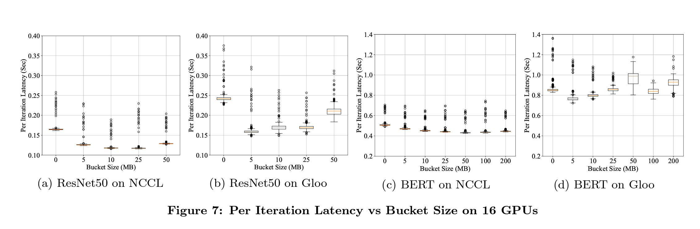
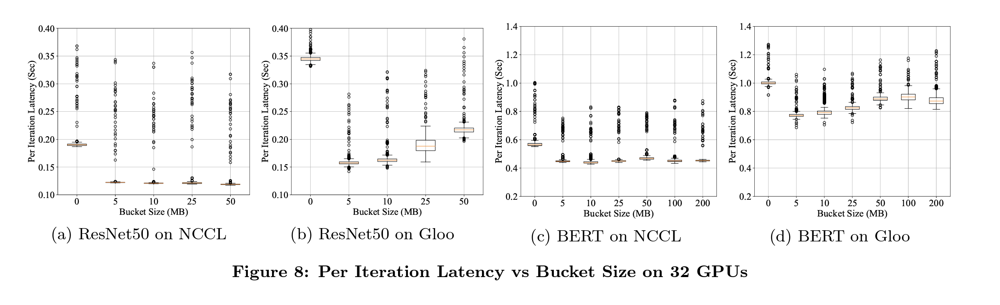
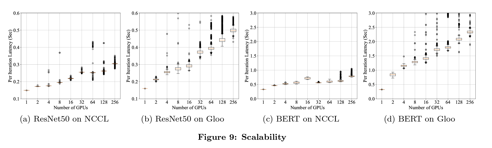

# PyTorch Distributed: <br> Experiences on Accelerating Data Parallel Training
### Unveiling Efficiencies in Distributed Machine Learning
###### Sanho Lee, Euijae Kim | NYU Courant | 02/28/2024

<!-- paginate: true -->

--- 

# Motivation

## Data Parallelism
 
- Has emerged as a popular solution for distributed training
- Straightforward principle and broad applicability

## Large Datasets and Large Models

- Demands the ability to scale out model training to more computational resources.

---
# Main Contributions of the Work

1. **Design and Implementation Insight**: Offers a comprehensive view into the design and implementation of PyTorch's widely adopted, state-of-the-art distributed training solution.

2. **Real-world Application Caveats**: Unveils practical challenges and caveats (e.g., issues with pluralized graphs) that were previously overlooked, enhancing understanding of distributed training nuances.

3. **Performance Tuning Experiences**: Shares valuable performance tuning insights gathered from internal teams and the open-source community, alongside several strategies for future enhancements in distributed data parallel training.


---

# Overlapping Computation with Communication in DDP

## Key Idea
- Accelerate training by starting the AllReduce operation on gradients *before* the local backward pass completes.
- Utilizes bucketing to determine when to launch communications, enabling overlap of computation and communication.

---

## Implementation Highlights
- **Autograd Hooks**: Registers a hook for each gradient accumulator to fire after its corresponding accumulator updates the gradients. This triggers asynchronous AllReduce on the bucket if all gradients within it are ready.
- **Ordering and Bucketing Challenges**: Ensures consistent reducing order across processes to prevent mismatches and uses model parameters' reverse order as an approximation for bucketing order.
---

## Solutions to Caveats
- **Dynamic Autograd Graph**: PyTorch dynamically constructs the autograd graph, potentially leading to discrepancies in gradient readiness across processes. 
  - *Solution*: Use a consistent bucketing order and ensure no AllReduce on bucket \(i+1\) before bucket \(i\).
- **Partial Graph Execution**: Training iterations may involve sub-graphs, causing some gradients to be absent.
  - *Solution*: Proactively mark parameters as ready at the end of the forward pass to avoid waiting for absent gradients.

---
# Gradient Accumulation in DDP

## Purpose
- Addresses the challenge of reducing gradient synchronization frequencies to speed up distributed data parallel training.
- Facilitates training with large input batches by splitting them into micro-batches and accumulating gradients before synchronization.

---
## Conflict and Resolution
- **Conflict**: The gradient reduction algorithm marks unused parameters as ready at every forward pass end, conflicting with gradient accumulation over multiple iterations.
- **Resolution**: Introduce a `no_sync` interface to toggle synchronization behavior.
  - In `no_sync` mode, DDP hooks are disabled, allowing gradient accumulation without immediate synchronization.

---
## Implementation
```python
ddp = DistributedDataParallel(net)
with ddp.no_sync():
    for inp, exp in zip(inputs, expected_outputs):
        # No synchronization, accumulate grads
        loss_fn(ddp(inp), exp).backward()
    # Synchronize grads
    loss_fn(ddp(another_inp), another_exp).backward()
    opt.step()
```

---

# PyTorch DDP Evaluation: Questions & Hypotheses

- **Questions Posed by Authors**:
  1. How does the communication backend impact training latency?
  2. What is the optimal bucket size for gradient synchronization?
  3. How does scaling across multiple GPUs affect training efficiency?

- **Hypotheses**:
  1. **NCCL will outperform GLOO** in terms of reducing training latency due to its optimization for NVIDIA GPUs.
  2. **A medium bucket size** will strike the best balance between communication overhead and synchronization efficiency.
  3. **Scaling will increase latency** due to communication overhead but improve overall throughput.

---

# Latency Breakdown & Communication Backend

- **Hypothesis Confirmation**: NCCL significantly reduces latency compared to GLOO, especially in the backward pass where communication is most intensive.
- **Why?**: NCCL is optimized for NVIDIA's GPU architecture, enabling more efficient multi-GPU communication.
- **System Behavior**: The design of PyTorch DDP prioritizes overlapping communication with computation, a feature that NCCL exploits more effectively than GLOO.



---

# Optimal Bucket Size for Gradient Synchronization

- **Hypothesis Confirmation**: Medium bucket sizes (10-25MB for ResNet50 with NCCL) optimize the trade-off between communication frequency and volume.
- **Why?**: Smaller buckets cause frequent synchronization, increasing overhead. Larger buckets delay synchronization, causing idle GPU time.
- **Experiment Design Insight**: By testing various bucket sizes, the study identifies a sweet spot where synchronization overhead is minimized without significant delays in gradient updates.



---

# Scalability and Training Efficiency

- **Overall Trend**: Increased latency with more GPUs, but higher throughput.
- **Why?**: Additional GPUs increase the complexity of gradient synchronization across the network, leading to higher latency. However, the ability to train larger models or faster training of the same model showcases the system's scalability.
- **System and Experiment Design**: The use of a shared entitlement environment for larger scale experiments introduces variable network performance, which could further impact latency. Yet, the design of PyTorch DDP to efficiently manage distributed training tasks shows the system's capability to scale, albeit with the expected increase in per-iteration latency.



---

# Conclusion: PyTorch Distributed Data Parallel (DDP) Module

## Review of Problem and Its Complexity
The challenge was to enhance the efficiency of distributed training in PyTorch v1.5, crucial for handling large datasets and models with the need for scalability across computational resources.

## Main Contributions
- **Innovative Design**: 
- **Performance Evaluations**: 
---
## Critical Assessment

### Strengths
- **Scalability and Efficiency**: 
- **Practical Insights**: 
### Weaknesses
- **Complex Optimization**: 

### Unanswered Questions
- **Optimization Algorithms**: 
- **Community Contributions**: 
---
In conclusion, while the DDP module marks a significant advancement in distributed training efficiency, it invites further exploration into optimization techniques and community-driven innovations to fully realize  potential.

# Thank you 