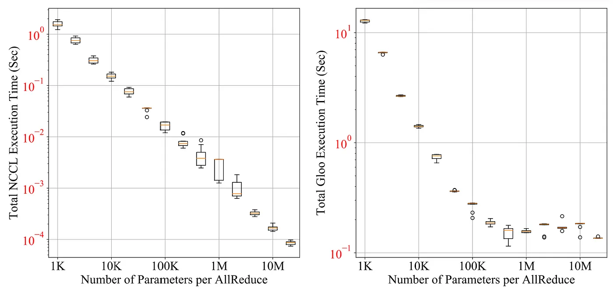

# Problem Definition

## Mathematical equivalence

- Applications expect to harvest the same result model as if all training had been performed locally without model replication
- DDP training and local training must be mathematically equivalent

## Non-intrusive and interceptive API

- No additional code change is required to integrate API into implementation
- Allow the internal implementation to timely intercept signals to carry out communications and system optimizations

---

# Problem Definition (Cont.)

## High performance

-  Data parallel training is subject to subtle dependencies between computations and communications
- The design and implementation have to explore the solution space to efficiently convert more resources into higher training throughput.

---

# Naive Solution of Gradient Reduction

```python
import torch
```

---

# Gradient Bucketing



---

## 6. Related Work

- https://arxiv.org/pdf/2309.06497.pdf / what are the most closely related other systems/results? how are they similar? how are they different? is the difference between the work you are presenting and the related work significant? / we expect you to find and read the major papers cited by the authors as related (you don’t need to read them in as much detail as the paper you are presenting! but in enough detail to understand how the work they describe differs from that in the paper you are presenting.)
- we expect you to search for more recent related work published after (or perhaps simultaneously with) the paper you are presenting – no need to claim the work you are presenting is “better” or “worse” than a particular piece of related work (though you may of course do so if you feel that way!); often it is simply that the two pieces of work are different–but you must articulate the precise difference (e.g., “these other authors solve a slightly different problem...”) / For each class, we often have presentations on two related papers. You are welcome to discuss related work with the team of the other presentation.
